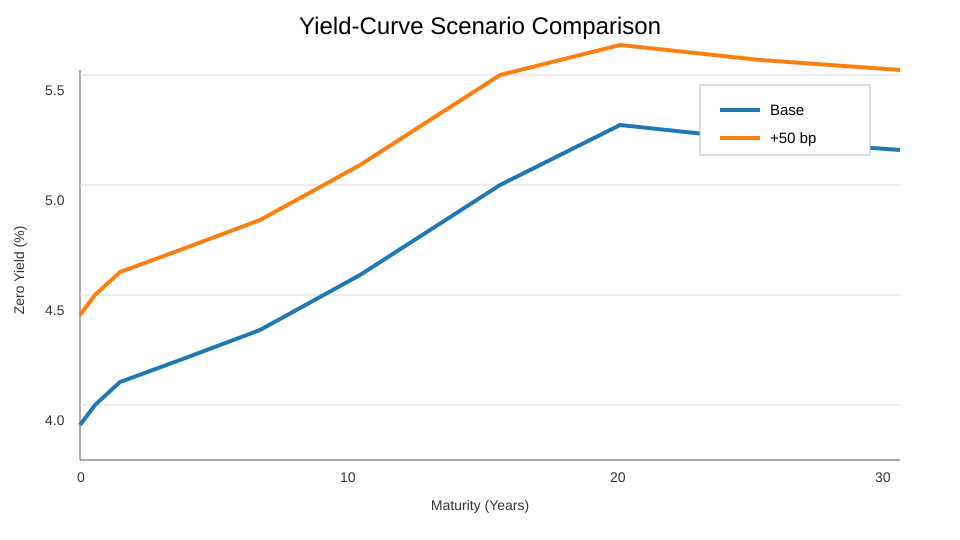
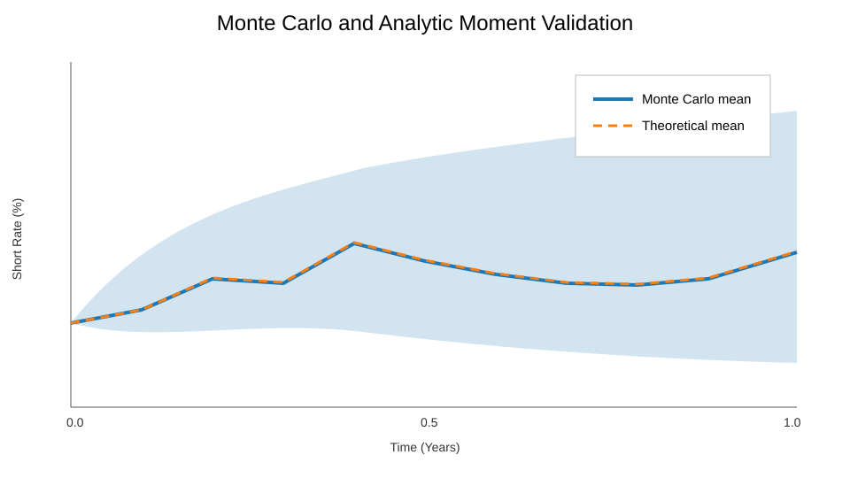
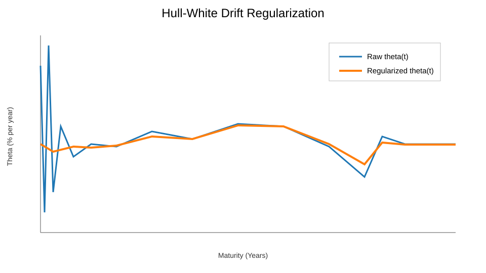

# Hull-White Yield Curve & Rate Simulation Engine

A Python fixed-income analytics application that retrieves the latest U.S. Treasury Constant Maturity Treasury (CMT) par curve, constructs an approximate zero-coupon curve, fits a one-factor Hull-White model, and simulates future short-rate and constant-maturity zero-yield distributions.

## Overview

The engine is designed as an educational fixed-income modeling and scenario-analysis tool. It converts Treasury par yields into approximate discount factors and zero-coupon rates, regularizes the model curve to stabilize derivatives, fits the Hull-White drift to the initial term structure, and generates Monte Carlo distributions for short rates and selected zero-coupon yields.

The model also compares simulated moments with analytic Hull-White moments and reruns the complete curve and simulation pipeline under parallel yield-curve shocks.

## Sample Outputs

### Yield-Curve Scenario Comparison



### Monte Carlo Validation



### Drift Regularization Diagnostic



## Features

- Retrieves the latest U.S. Treasury CMT par yields from the Treasury XML feed
- Supports CSV curve inputs as either par yields or zero-coupon yields
- Converts Treasury par yields into an approximate zero-coupon curve with a semiannual bootstrap
- Constructs discount factors, zero yields, and instantaneous forward rates
- Regularizes the log-discount curve with an adaptive cubic smoothing spline
- Fits the one-factor Hull-White drift function to the model term structure
- Simulates short rates with exact Ornstein-Uhlenbeck state transitions
- Prices zero-coupon bonds and derives simulated constant-maturity zero yields
- Tracks 2-year, 5-year, and 10-year zero-yield distributions by default
- Compares Monte Carlo mean and volatility with analytic model moments
- Runs base and parallel ±50-basis-point input-curve scenarios
- Reports curve-fitting, repricing, stability, and simulation diagnostics
- Includes an eight-test regression suite

## Methodology

### Treasury curve conversion

Treasury CMT observations are par yields rather than zero-coupon rates. The engine uses an approximate semiannual bootstrap to solve sequentially for discount factors and then derives continuously compounded zero yields.

Treasury does not publish the exact internal zero curve used in its CMT methodology, so this conversion is an approximation rather than a reproduction of an official Treasury zero curve.

### Curve regularization

Hull-White drift construction depends on derivatives of the instantaneous forward curve. Small irregularities in an interpolated market curve can become large spikes after differentiation.

The engine therefore retains the bootstrapped market-node curve for comparison while fitting a regularized cubic spline to log discount factors for model pricing, forward-rate construction, and drift calculation. The smoothing level is selected subject to a small maximum discount-factor deviation.

### Hull-White model

The short rate follows the one-factor process:

```text
dr(t) = [theta(t) - a * r(t)] dt + sigma dW(t)
```

where:

- `r(t)` is the short rate
- `a` is the mean-reversion parameter
- `sigma` is the short-rate volatility parameter
- `theta(t)` is the time-dependent drift-fitting function
- `dW(t)` is a Brownian-motion shock

The default parameters `a = 0.15` and `sigma = 1.0%` are user-specified assumptions. They are not calibrated to caps, swaptions, or historical rate data.

## Requirements

- Python 3.10 or newer
- Internet access for live Treasury data

Install dependencies with:

```bash
pip install -r requirements.txt
```

## Usage

Run the engine from the repository directory:

```bash
python hull_white_engine.py
```

The default run:

- Downloads the latest Treasury CMT curve
- Simulates 5,000 one-year short-rate paths using monthly time steps
- Tracks 2-year, 5-year, and 10-year constant-maturity zero yields
- Runs base, +50 bp, and -50 bp curve scenarios
- Prints diagnostics and distribution summaries
- Opens the model charts in Matplotlib windows

Press Enter in the terminal after reviewing the plots to close all chart windows.

## Configuration

Default assumptions are defined in `load_settings_from_json()` inside `core.py`. The most important configurable fields are:

- `mean_reversion`
- `sigma`
- `n_paths`
- `horizon_years`
- `dt`
- `seed`
- `yield_maturities_to_track`
- `source`
- `csv_path`

## Tests

Run the regression suite with:

```bash
python -m unittest test_hull_white_engine.py
```

The tests cover initial-curve repricing, flat-curve consistency, par-yield bootstrapping, Hull-White drift construction, exact-transition simulation moments, scenario shocks, negative-rate handling, and inverted-curve handling.

## Project Structure

```text
hull-white-rate-engine/
├── hull_white_engine.py
├── core.py
├── engine.py
├── reporting.py
├── test_hull_white_engine.py
├── requirements.txt
├── README.md
├── .gitignore
└── images/
    ├── scenario_comparison.svg
    ├── monte_carlo_validation.svg
    └── theta_regularization.svg
```

## Limitations

- The Treasury par-to-zero conversion is approximate and does not reproduce Treasury's unpublished internal zero curve.
- Mean reversion and volatility are user-specified rather than market-calibrated.
- The model has one stochastic factor and cannot independently model level, slope, and curvature movements.
- The regularized curve prioritizes stable derivatives while remaining close to the bootstrapped discount factors.
- The simulated distributions are conditional model scenarios, not forecasts of future Treasury rates.
- The engine is intended for education, research, and portfolio demonstration rather than production pricing or trading.

## Disclaimer

This project is for educational and research purposes only. It is not investment advice and should not be used as the sole basis for trading, valuation, or risk-management decisions.
